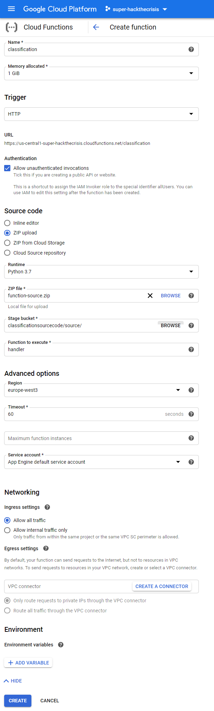

# SUPER AGAINST COVID19

##### Classifying X-Ray images with Neural Networks to extract Covid-19 cases

Part of the https://www.hackthecrisis.at/ online hackathon
Final Pitch: https://youtu.be/kgL3QGXr82g

Inspired by and original code from: https://www.pyimagesearch.com/2020/03/16/detecting-covid-19-in-x-ray-images-with-keras-tensorflow-and-deep-learning/

# Setup Frontend

Avalible over the following link: https://0b01001101.github.io/covid19-classification/webapp/app.html

The Frontend is a static webpage, hostet on Github Pages. No real setup steps required, exept enable Githb Pages:
https://guides.github.com/features/pages/

Illustraions from: https://undraw.co/illustrations - https://undraw.co/license
Icons from: https://iconmonstr.com/ - https://iconmonstr.com/license/

# Setup Backend

The Backend runs on Python Google Cloud Functions
No image data or results are stored on the GCP servers

Some Limetations of Cloud Functions:

- File System is read only, so no images can temporarely be saved
- Tensorflow 2.1.0 can't be installt, the build of the container will fail. Use tensorflow 2.0.0

The following files should be converted in a zip archive for the next step:

- main.py
- requirements.txt
- modelV3.h5

For the Code a Cloud Storage Bucket is needed. See /docs/CreateStorageBucket.png

Setup the Cloud function in the following way:

